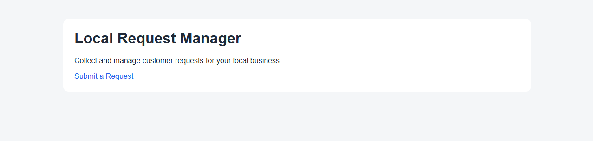
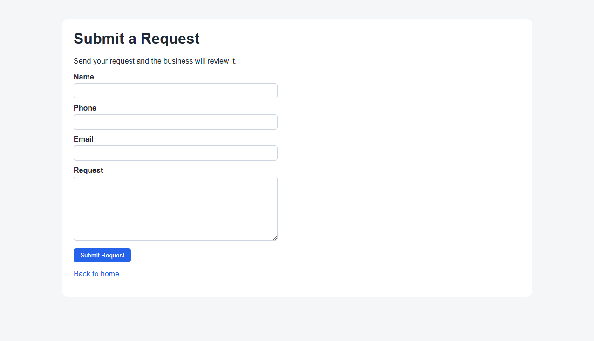
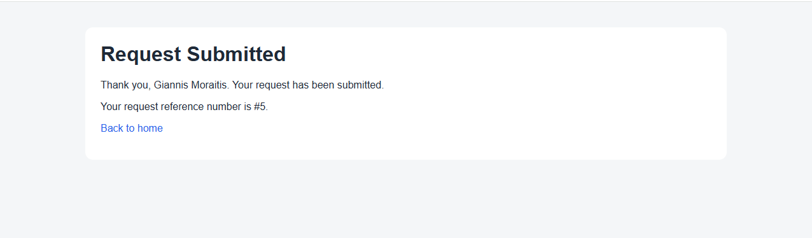
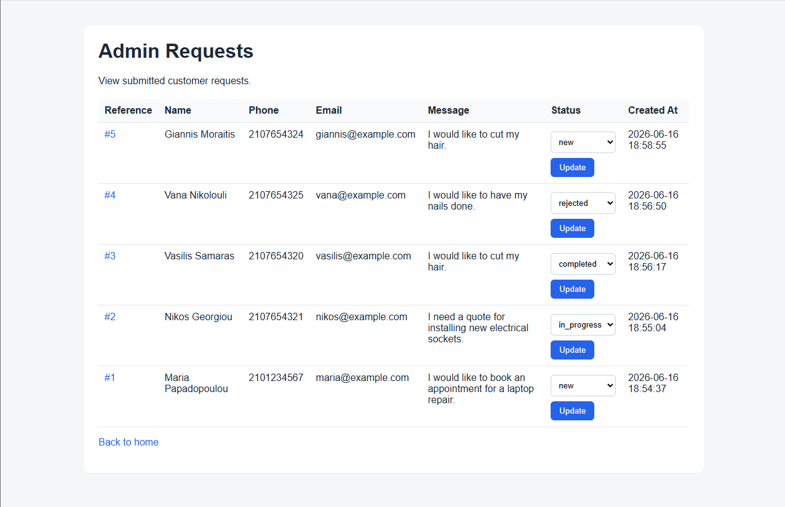
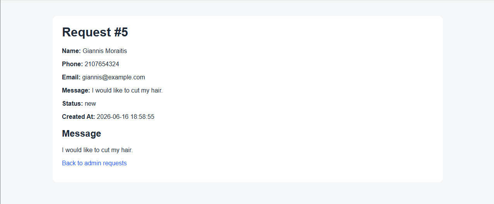

# Local Request Manager

A small FastAPI web app for local businesses to collect, view, and manage customer requests.

The goal of this project is to build a realistic small-business backend/web application with a simple public request form, SQLite persistence, and an admin interface for request management.

## Problem

Small local businesses often receive customer requests through many different channels, such as phone calls, social media messages, emails, and handwritten notes. This makes it easy to lose requests, forget details, or fail to track the current status of each request.

## Solution

Local Request Manager provides:

* a public landing page
* a customer request/contact form
* request storage in SQLite
* an admin page for viewing submitted requests
* request detail pages
* status management for each request

## Target Users

This app is designed for small local businesses such as:

* car repair shops
* hair salons
* computer repair technicians
* plumbers or electricians
* tutoring centers
* pet grooming businesses

## Current Features

### Public Side

* Landing page
* Request/contact form
* Success message after form submission
* Request reference number after submission

### Admin Side

* View all submitted customer requests
* View request details
* Update request status
* Basic admin table styling

## Request Statuses

The app currently supports the following request statuses:

* `new`
* `in_progress`
* `completed`
* `rejected`

## Tech Stack

* Python
* FastAPI
* Jinja2 templates
* SQLite
* Python `sqlite3` module
* HTML
* CSS

## Project Structure

```text
local-request-manager/
├── app/
│   ├── __init__.py
│   ├── database.py
│   └── main.py
├── static/
│   └── styles.css
├── templates/
│   ├── admin_request_detail.html
│   ├── admin_requests.html
│   ├── index.html
│   ├── request_form.html
│   └── request_success.html
├── .gitignore
├── README.md
└── requirements.txt
```

## Main Routes

### Public Routes

| Method | Path            | Description          |
| ------ | --------------- | -------------------- |
| GET    | `/`             | Landing page         |
| GET    | `/requests/new` | Request form         |
| POST   | `/requests`     | Submit a new request |

### Admin Routes

| Method | Path                                  | Description           |
| ------ | ------------------------------------- | --------------------- |
| GET    | `/admin/requests`                     | View all requests     |
| GET    | `/admin/requests/{request_id}`        | View request details  |
| POST   | `/admin/requests/{request_id}/status` | Update request status |

## Running the Project Locally

### 1. Clone the repository

```bash
git clone <repository-url>
cd local-request-manager
```

### 2. Create and activate a virtual environment

On Windows PowerShell:

```powershell
python -m venv .venv
.\.venv\Scripts\Activate.ps1
```

### 3. Install dependencies

```powershell
pip install -r requirements.txt
```

### 4. Run the app

```powershell
uvicorn app.main:app --reload
```

Then open:

```text
http://127.0.0.1:8000
```

## Screenshots

### Landing Page



### Request Form



### Request Submitted



### Admin Requests List



### Request Detail Page




## Out of Scope for MVP

The first version will not include:

* React frontend
* Payments
* Email or SMS notifications
* Multi-business SaaS features
* Advanced analytics
* Docker or Kubernetes
* AI features

## Milestones

### Milestone 0: Scope & Setup

Defined the project scope, stack, repository name, and README.

### Milestone 1: Basic FastAPI App

Created the initial FastAPI app and rendered a landing page.

### Milestone 2: Request Form

Created a public request form and handled submissions.

### Milestone 3: Database

Stored customer requests in SQLite.

### Milestone 4: Admin Requests List

Displayed submitted requests in an admin page.

### Milestone 5: Status Management

Allowed the admin to update request statuses.

### Milestone 6: Deployment Prep

Added basic styling and started preparing the project for screenshots and deployment.

## Next Steps

* Add screenshots to the README
* Prepare deployment configuration
* Deploy the app
* Add basic admin protection in a future version
* Consider PostgreSQL for a production-ready database later
