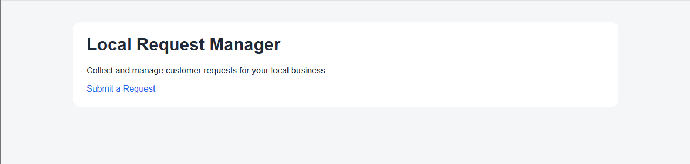
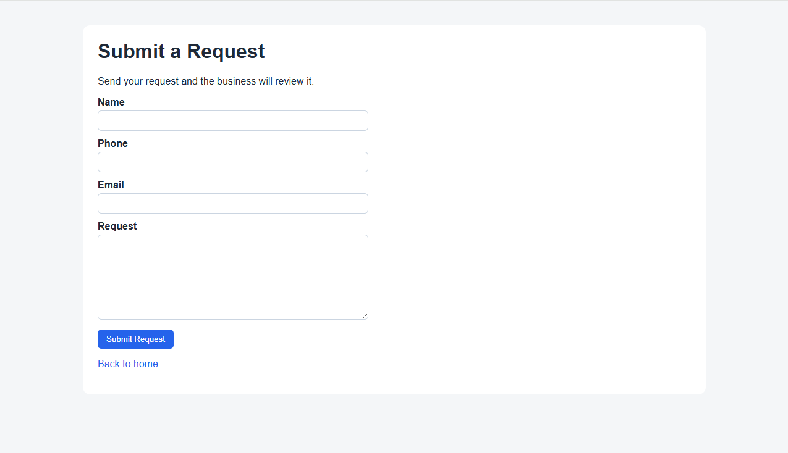
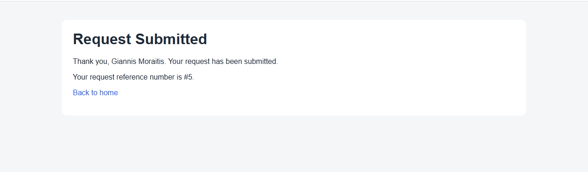
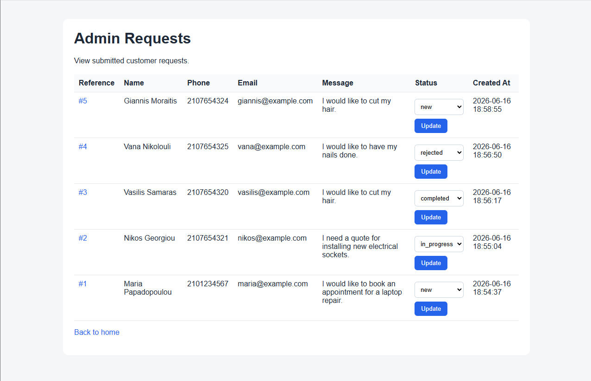
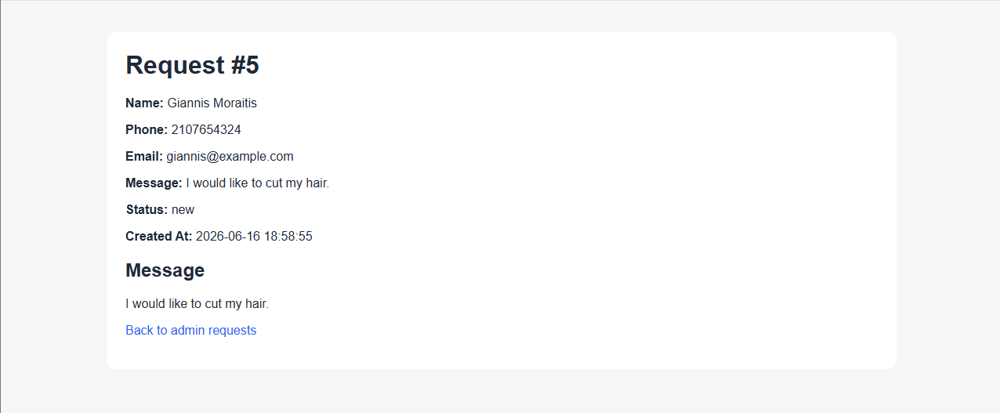

# Local Request Manager

A small FastAPI web app for local businesses to collect, view, and manage customer requests.

The goal of this project is to build a realistic small-business backend/web application with a simple public request form, PostgreSQL persistence, and an admin interface for request management.

## Problem

Small local businesses often receive customer requests through many different channels, such as phone calls, social media messages, emails, and handwritten notes. This makes it easy to lose requests, forget details, or fail to track the current status of each request.

## Solution

Local Request Manager provides:

* a public landing page
* a customer request/contact form
* request storage in PostgreSQL
* an admin page for viewing submitted requests
* request detail pages
* status management for each request

## Target Users

This app is designed for small local businesses such as:

* car repair shops
* hair salons
* computer repair technicians
* plumbers or electricians
* tutoring centers
* pet grooming businesses

## Current Features

### Public Side

* Landing page
* Request/contact form
* Success message after form submission
* Request reference number after submission

### Admin Side

* View all submitted customer requests
* View request details
* Update request status
* Password-based admin authentication with signed sessions
* Admin logout
* Basic admin table styling

## Request Statuses

The app currently supports the following request statuses:

* `new`
* `in_progress`
* `completed`
* `rejected`

## Tech Stack

* Python
* FastAPI
* Jinja2 templates
* PostgreSQL
* SQLAlchemy Core
* Psycopg 3
* HTML
* CSS

## Project Structure

```text
local-request-manager/
├── app/
│   ├── __init__.py
│   ├── database.py
│   └── main.py
├── static/
│   └── styles.css
├── templates/
│   ├── admin_login.html
│   ├── admin_request_detail.html
│   ├── admin_requests.html
│   ├── index.html
│   ├── request_form.html
│   └── request_success.html
├── .gitignore
├── README.md
└── requirements.txt
```

## Main Routes

### Public Routes

| Method | Path            | Description          |
| ------ | --------------- | -------------------- |
| GET    | `/`             | Landing page         |
| GET    | `/requests/new` | Request form         |
| POST   | `/requests`     | Submit a new request |

### Admin Routes

| Method | Path | Description |
|---|---|---|
| GET | `/admin/login` | Admin login form |
| POST | `/admin/login` | Submit admin password |
| POST | `/admin/logout` | Logout admin |
| GET | `/admin/requests` | View all requests |
| GET | `/admin/requests/{request_id}` | View request details |
| POST | `/admin/requests/{request_id}/status` | Update request status |

## Live Deployment

Live demo: [Open the live application](https://local-request-manager.onrender.com/)

This deployment is intended for portfolio and demonstration purposes only. The application uses managed PostgreSQL in Neon, and the data persists when Render restarts or redeploys the service.

The Render service must define `APP_ENV=production`. The application accepts only `development` and `production` as valid environment values. Production mode enables the `Secure` attribute on the admin session cookie because the application runs over HTTPS in production.

Do not submit real, sensitive, or production data.

## Running the Project Locally

### 1. Clone the repository

```bash
git clone <repository-url>
cd local-request-manager
```

### 2. Create and activate a virtual environment

On Windows PowerShell:

```powershell
python -m venv .venv
.\.venv\Scripts\Activate.ps1
```

### 3. Install dependencies

```powershell
pip install -r requirements.txt
```

### 4. Set the database URL

For local development, use the connection string from the Neon `development` branch. The live Render deployment uses a separate production database branch.

The URL must use the `postgresql+psycopg://` scheme. Never commit database connection strings to Git.

On Windows PowerShell:

```powershell
$env:DATABASE_URL = Read-Host "Paste your PostgreSQL DATABASE_URL"
```

### 5. Set the admin password

On Windows PowerShell:

```powershell
$env:ADMIN_PASSWORD = "change-this-password"
```

The admin password is required before starting the application. It is read from an environment variable so that secrets are not stored in the source code.

### 6. Set the session secret

On Windows PowerShell:

```powershell
$env:SESSION_SECRET = python -c "import secrets; print(secrets.token_urlsafe(32))"
```

The session secret is used to sign the admin session cookie. Keep it secret and stable between application restarts, use a different value for each environment, and never commit it to Git.

### 7. Set the application environment

On Windows PowerShell:

```powershell
$env:APP_ENV = "development"
```

The application accepts only `development` and `production`:

* Use `development` when running locally over HTTP.
* Use `production` when deploying to Render over HTTPS. Production mode enables the `Secure` attribute on the admin session cookie.

### 8. Run the application

```powershell
python -m uvicorn app.main:app --reload
```

Then open:

```text
http://127.0.0.1:8000
```

Admin area:

```text
http://127.0.0.1:8000/admin/login
```

## Screenshots

### Landing Page



### Request Form



### Request Submitted



### Admin Requests List



### Request Detail Page



## Out of Scope for MVP

The first version will not include:

* React frontend
* Payments
* Email or SMS notifications
* Multi-business SaaS features
* Advanced analytics
* Docker or Kubernetes
* AI features

## Milestones

### Milestone 0: Scope & Setup

Defined the project scope, stack, repository name, and README.

### Milestone 1: Basic FastAPI App

Created the initial FastAPI app and rendered a landing page.

### Milestone 2: Request Form

Created a public request form and handled submissions.

### Milestone 3: Database

Stored customer requests in SQLite.

### Milestone 4: Admin Requests List

Displayed submitted requests in an admin page.

### Milestone 5: Status Management

Allowed the admin to update request statuses.

### Milestone 6: Deployment

Added basic styling and deployed the application to Render.

### Milestone 7: PostgreSQL Migration

Migrated the persistence layer from SQLite to managed PostgreSQL in Neon using SQLAlchemy Core and Psycopg 3.

### Milestone 8: Database Environment Separation

Separated local development and live deployment data by using isolated Neon database branches.

### Milestone 9: Signed Admin Sessions

Replaced the temporary in-memory admin session token with signed cookie-based sessions using Starlette's `SessionMiddleware`. Admin sessions now remain valid across application restarts when the `SESSION_SECRET` remains unchanged.
